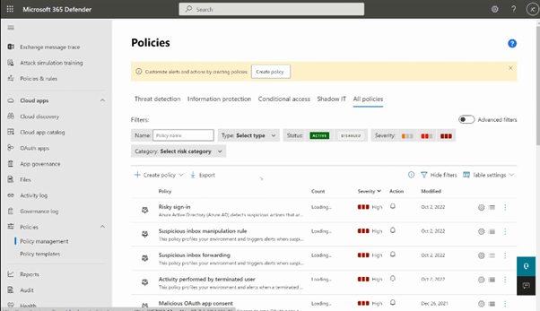

# Create-a-File-policy-for-Cloud-Apps
Use Defender for Cloud Apps &amp; create a file policy for detection of sharing US PII. Set email alert. 

<h2>Description</h2>
Project consists of a creating a Risk-based access policies as a part of Azure AD Identity Protection policies. Risk-based access policies, there are two types of risk policies in Azure Active Directory (Azure AD) Conditional Access we can set up to automate the response to risks and allow users to self-remediate when risk is detected: Sign-in risk policy and User-risk policy. In this practical, it is auto applying for High risk level.
<br />


<h2>Environments Used </h2>

- <b>Microsoft 365 Defender portal</b> 

<h2>Prerequisites</h2>

-<b> File policy for cloud apps can be created or modified by anyone assigned the following roles:
 - Security Administrator
 - Global Administrator
 </b>
- <b> Licenses: at-least Azure Active Directory Premium P1</b>

<h2>Program walk-through:</h2>

<h3>Steps: </h3>

1.  Go to Microsoft 365 defender
2.	Cloud apps section --> select policies --> policies management
3.	Create policy --> select category ‘file policy’
4.	Give a name, select a ‘sharing control’ as category
5.	Select users-groups, select inspection method & US : PII Social security number
6.	Select alert as email and add email id of recipient
7.	Create


<h3>Screenshots:</h3>

<p align="center">
Policy Management: <br/>

<br />
<br />
Create a new Policy: <br/>

<br />
<br />
Give a name: <br/>

<br />
<br />
Select Users and Inspection method: <br/>

<br />
<br />
Alert settings: <br/>

<br />
<br />


</p>

<!--
 ```diff
- text in red
+ text in green
! text in orange
# text in gray
@@ text in purple (and bold)@@
```
--!>
